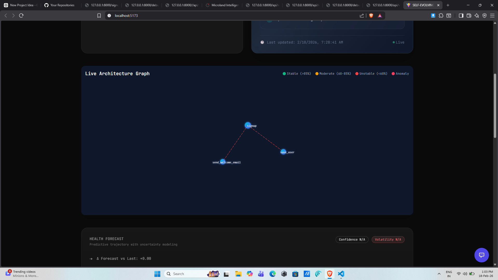
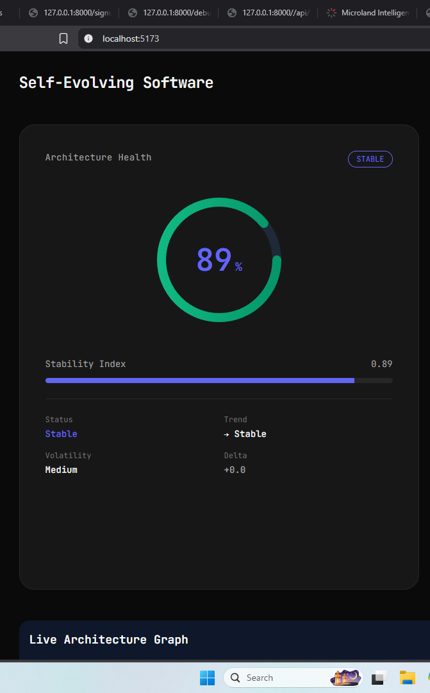
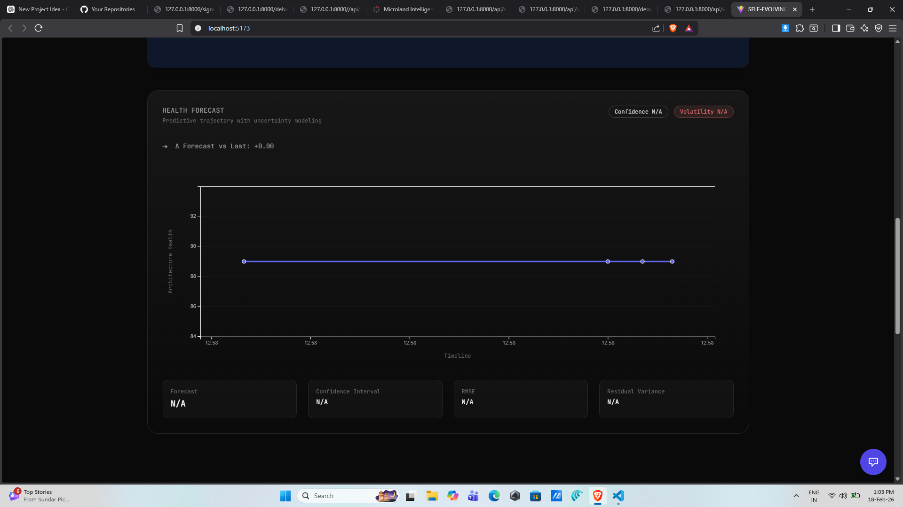
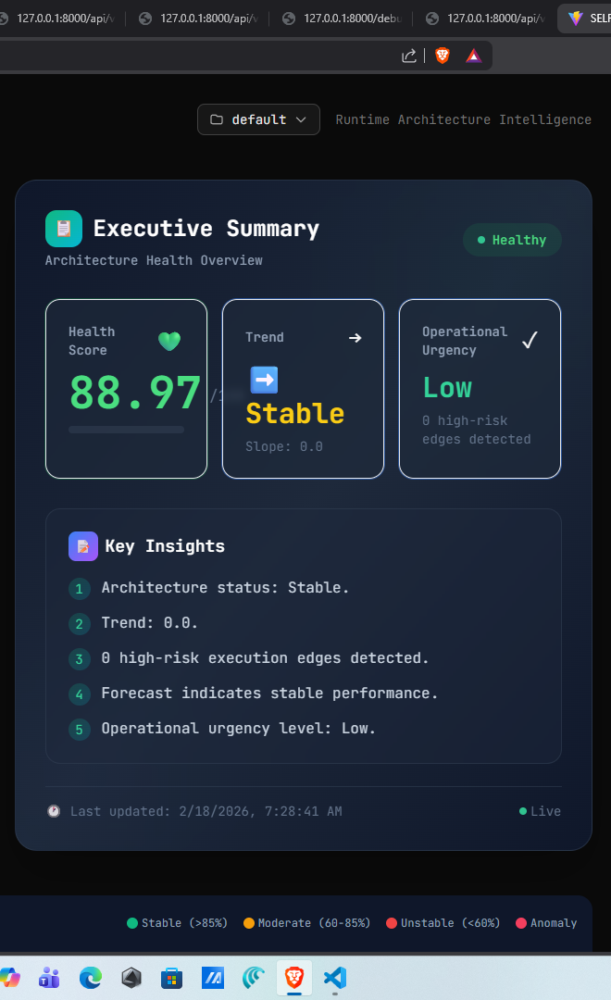
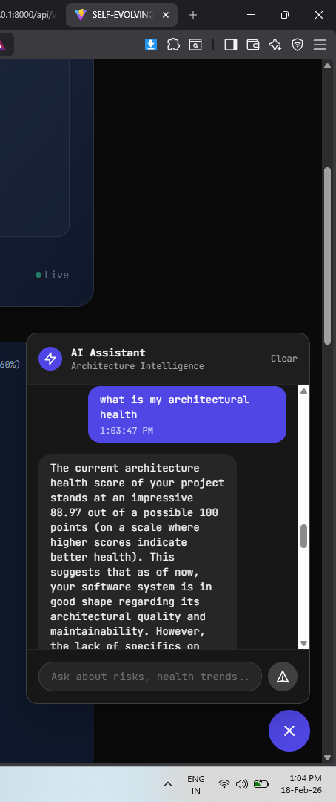

# SES Intelligence - Self-Evolving Software Platform

<p align="center">
  <a href="https://pypi.org/project/ses-intelligence/">
    
  </a>
  <a href="https://pypi.org/project/ses-intelligence/">
    
  </a>
  <a href="https://opensource.org/licenses/MIT">
    
  </a>
  <a href="https://github.com/dummy-pranjal29/self-explaining-software/actions">
    
  </a>
</p>

**SES Intelligence** is a comprehensive runtime intelligence platform that monitors, analyzes, and explains software behavior changes in real-time. It automatically builds architecture graphs from function calls, computes health scores, forecasts potential issues, and provides an interactive dashboard for visualization.

## What is SES?

SES (Self-Evolving Software) Intelligence is a full-stack platform consisting of:

| Component     | Description                                            |
| ------------- | ------------------------------------------------------ |
| **SDK**       | Framework-agnostic Python library for behavior tracing |
| **API**       | Django REST API for data persistence and management    |
| **Dashboard** | React-based UI for real-time visualization             |

### Core Features

- **Behavior Tracing**: Automatically captures function call relationships to build dynamic architecture graphs
- **Health Scoring**: Computes architecture health scores based on complexity, stability, and risk factors
- **Forecasting**: Predicts future health trends using historical data analysis
- **Narrative Generation**: Generates human-readable explanations of architecture changes (with LLM)
- **Interactive Dashboard**: Real-time visualization with live metrics, health gauges, and forecast timelines

---

## Table of Contents

1. [Installation](#installation)
2. [Quick Start](#quick-start)
3. [SDK Usage](#sdk-usage)
4. [API Server](#api-server)
5. [Dashboard](#dashboard)
6. [Configuration](#configuration)
7. [CLI Commands](#cli-commands)
8. [API Endpoints](#api-endpoints)
9. [Examples](#examples)
10. [Troubleshooting](#troubleshooting)
11. [When to Expect Changes](#when-to-expect-changes)
12. [When NOT to Expect Changes](#when-not-to-expect-changes)

---

## Installation

### Prerequisites

| Requirement | Version             |
| ----------- | ------------------- |
| Python      | 3.8+                |
| Node.js     | 18+ (for dashboard) |
| pip         | 21.0+               |

### Install SDK (Python Package)

```bash
# Install core package (minimal dependencies)
pip install ses-intelligence

# Or with extras for specific features
pip install ses-intelligence[ml]        # ML features for anomaly detection
pip install ses-intelligence[llm]       # LLM-powered explanations
pip install ses-intelligence[flask]     # Flask integration
pip install ses-intelligence[fastapi]   # FastAPI integration
pip install ses-intelligence[django]    # Django integration

# Install ALL features
pip install ses-intelligence[all]
```

### Install from Source

```bash
# Clone the repository
git clone https://github.com/dummy-pranjal29/self-explaining-software.git
cd self-explaining-software

# Install SDK in development mode
pip install -e .

# Or with all dependencies
pip install -e ".[all]"
```

### Install Dashboard Dependencies

```bash
# Navigate to dashboard directory
cd ses-dashboard

# Install Node.js dependencies
npm install

# Build for production
npm run build
```

---

## Quick Start

### Option 1: Standalone SDK (5 minutes)

Use the SDK directly in your Python application without the API or dashboard.

```python
from ses_intelligence import initialize, trace_behavior
from ses_intelligence.architecture_health.engine import ArchitectureHealthEngine

# Step 1: Initialize the engine
initialize(project_id="my-app")

# Step 2: Instrument your functions
@trace_behavior
def save_user(user_data):
    validate_email(user_data)
    store_in_database(user_data)
    send_welcome_email(user_data)
    return {"status": "success"}

@trace_behavior
def validate_email(user_data):
    if "@" not in user_data.get("email", ""):
        raise ValueError("Invalid email")
    return True

@trace_behavior
def store_in_database(user_data):
    pass  # Your DB logic

@trace_behavior
def send_welcome_email(user_data):
    pass  # Your email logic

# Step 3: Run your code - the engine automatically traces calls
result = save_user({"name": "John", "email": "john@example.com"})

# Step 4: Get health score
health = ArchitectureHealthEngine().compute()
print(f"Health: {health['overall_score']}/100")
print(f"Stability: {health['stability_index']}")
print(f"Risk Level: {health['risk_level']}")
```

Run it:

```bash
python examples/plain_python/example.py
```

### Option 2: Full Platform (15 minutes)

Run the complete platform: SDK + API + Dashboard.

```bash
# Step 1: Start the Django API server
cd /path/to/project
python manage.py runserver 0.0.0.0:8000

# Step 2: In another terminal, start the React dashboard
cd ses-dashboard
npm run dev

# Step 3: Open your browser
# - Dashboard: http://localhost:5173
# - API: http://localhost:8000/api/
```

---

## SDK Usage

### Basic Usage

```python
from ses_intelligence import initialize, trace_behavior, get_runtime_snapshots
from ses_intelligence.architecture_health.engine import ArchitectureHealthEngine
from ses_intelligence.architecture_health.forecasting import ArchitectureHealthForecaster

# Initialize with project ID
initialize(
    project_id="my-production-app",
    enable_forecasting=True,
    enable_narratives=True,
)

# Instrument any function
@trace_behavior
def process_payment(order_id: int, amount: float):
    authorize_payment(order_id, amount)
    capture_payment(order_id, amount)
    send_receipt(order_id)
    return {"status": "completed"}

@trace_behavior
def authorize_payment(order_id, amount):
    # Payment authorization
    pass

@trace_behavior
def capture_payment(order_id, amount):
    # Payment capture
    pass

@trace_behavior
def send_receipt(order_id):
    # Send receipt email
    pass

# Run your application code
for order in orders:
    process_payment(order["id"], order["amount"])

# Get snapshots for analysis
snapshots = get_runtime_snapshots()

# Compute health
health = ArchitectureHealthEngine(snapshots=snapshots).compute()

# Forecast future health
forecast = ArchitectureHealthForecaster().forecast(steps_ahead=5)
```

### Framework-Specific Usage

#### Flask

```python
from flask import Flask, request, jsonify
from ses_intelligence import initialize, trace_behavior

initialize(project_id="flask-app")

app = Flask(__name__)

@trace_behavior
def process_request(data):
    validate(data)
    save(data)
    return {"status": "ok"}

@trace_behavior
def validate(data):
    pass

@trace_behavior
def save(data):
    pass

@app.route("/api/data", methods=["POST"])
def handle_data():
    result = process_request(request.json)
    return jsonify(result)

if __name__ == "__main__":
    app.run(debug=True, port=5000)
```

Run:

```bash
pip install ses-intelligence[flask]
python examples/flask_app/app.py
```

#### FastAPI

```python
from fastapi import FastAPI
from pydantic import BaseModel
from ses_intelligence import initialize, trace_behavior

initialize(project_id="fastapi-app")

app = FastAPI()

class Item(BaseModel):
    name: str
    price: float

@trace_behavior
def create_item(item: Item):
    validate_item(item)
    save_item(item)
    return {"id": 1, **item.dict()}

@trace_behavior
def validate_item(item):
    pass

@trace_behavior
def save_item(item):
    pass

@app.post("/items/")
async def post_item(item: Item):
    return create_item(item)

if __name__ == "__main__":
    import uvicorn
    uvicorn.run(app, host="0.0.0.0", port=8000)
```

Run:

```bash
pip install ses-intelligence[fastapi]
python examples/fastapi_app/app.py
```

#### Django

Add to your `settings.py`:

```python
# settings.py

INSTALLED_APPS = [
    # ... your apps
    'ses_intelligence',
]

MIDDLEWARE = [
    # ... other middleware
    'ses_intelligence.middleware.SESMiddleware',
]

# SES Configuration
SES_CONFIG = {
    'project_id': 'my-django-app',
    'enable_forecasting': True,
    'enable_narratives': True,
}
```

In your views:

```python
# views.py
from ses_intelligence import trace_behavior
from django.http import JsonResponse

@trace_behavior
def my_view(request):
    # Your view logic
    process_data(request)
    return JsonResponse({"status": "ok"})

@trace_behavior
def process_data(request):
    # Business logic
    pass
```

Run:

```bash
pip install ses-intelligence[django]
python manage.py runserver
```

---

## API Server

### Starting the API Server

```bash
# Ensure Django dependencies are installed
pip install django>=4.0

# Run migrations
python manage.py migrate

# Start the server
python manage.py runserver 0.0.0.0:8000
```

### API Server Endpoints

| Endpoint                 | Method         | Description                    |
| ------------------------ | -------------- | ------------------------------ |
| `/api/v1/health/`        | GET            | Get architecture health score  |
| `/api/v1/forecast/`      | GET            | Get health forecast            |
| `/api/v1/graph/`         | GET            | Get runtime architecture graph |
| `/api/v1/impact/`        | GET            | Get impact analysis            |
| `/api/v1/executive/`     | GET            | Get executive summary          |
| `/api/v1/projects/`      | GET/POST       | List/create projects           |
| `/api/v1/projects/<id>/` | GET/PUT/DELETE | Project CRUD                   |
| `/api/v1/chat/`          | POST           | LLM-powered Q&A                |

### Example API Calls

```bash
# Get health score
curl "http://localhost:8000/api/v1/health/?project=my-app"

# Get forecast
curl "http://localhost:8000/api/v1/forecast/?project=my-app&horizon=5"

# Get architecture graph
curl "http://localhost:8000/api/v1/graph/?project=my-app"

# List all projects
curl "http://localhost:8000/api/v1/projects/"

# Get executive summary
curl "http://localhost:8000/api/v1/executive/?project=my-app"
```

---

## Dashboard

### Setup

```bash
# Navigate to dashboard directory
cd ses-dashboard

# Install dependencies
npm install

# Start development server
npm run dev
```

The dashboard will be available at `http://localhost:5173`

### Building for Production

```bash
# Build the dashboard
npm run build

# The built files will be in dist/
```

### Dashboard Features

| Feature                | Description                                       |
| ---------------------- | ------------------------------------------------- |
| **Health Gauge**       | Real-time health score visualization (0-100)      |
| **Architecture Graph** | Live visualization of function call relationships |
| **Forecast Timeline**  | Historical and predicted health trends            |
| **Executive Panel**    | High-level summary for stakeholders               |
| **AI Chat**            | LLM-powered Q&A about your architecture           |

### Dashboard Screenshots

Here's what the SES Intelligence Dashboard looks like:

#### Main Dashboard View


The main dashboard provides a comprehensive overview of your application's architecture health with real-time metrics, interactive charts, and quick access to all features.

#### Architecture Graph



Visualize function call relationships as an interactive graph. Nodes represent functions, edges show call relationships, and colors indicate health status.

#### Health Gauge



The health gauge displays your overall architecture health score (0-100) with trend indicators showing if health is improving, stable, or degrading.

#### Forecast Timeline



View historical health data alongside AI-powered predictions. Confidence intervals show the reliability of forecasts.

#### Executive Panel



A high-level summary designed for stakeholders, showing key metrics and recommendations at a glance.

> **Note**: Replace the placeholder images in the `images/` folder with actual screenshots from your running dashboard. Recommended image sizes:
>
> - Main dashboard: 1200x800px
> - Architecture graph: 800x600px
> - Health gauge: 400x400px
> - Forecast timeline: 800x400px
> - Executive panel: 800x600px
> - AI Chat: 800x600px

#### AI Chat



The AI Chat feature allows you to ask questions in natural language about your application's architecture. Powered by LLMs, it can explain health scores, suggest improvements, and help you understand complex architectural patterns.

---

## Configuration

### Environment Variables

| Variable                | Description                       | Default             |
| ----------------------- | --------------------------------- | ------------------- |
| `SES_PROJECT_ID`        | Default project ID                | `"default"`         |
| `SES_DATA_DIR`          | Data storage directory            | `"./behavior_data"` |
| `OPENAI_API_KEY`        | OpenAI API key for LLM features   | `None`              |
| `CELERY_BROKER_URL`     | Celery broker URL for async tasks | `None`              |
| `CELERY_RESULT_BACKEND` | Celery result backend             | `None`              |
| `DATABASE_URL`          | Database connection string        | SQLite (local)      |

### SDK Configuration Options

```python
from ses_intelligence import initialize

config = initialize(
    # Project Configuration
    project_id="my-app",              # Required: unique project identifier
    project_name="My Application",    # Optional: human-readable name
    storage_path="/data/ses",         # Optional: custom storage path

    # Engine Configuration
    enable_background_tasks=False,   # Enable async task processing
    enable_health_tracking=True,     # Enable health score tracking
    enable_forecasting=True,         # Enable health forecasting
    enable_narratives=True,          # Enable narrative generation

    # Forecasting Configuration
    forecast_window_size=10,         # Window size for forecasting
    forecast_confidence_floor=0.70,  # Minimum confidence threshold

    # Storage Configuration
    data_retention_days=90,          # Days to retain historical data
    snapshot_retention_count=100,    # Max snapshots to retain

    # LLM Configuration
    llm_api_key="sk-...",           # OpenAI API key
    llm_model="gpt-4o-mini",        # LLM model to use

    # Django Configuration (if using Django)
    django_settings={},             # Django settings dict
)
```

### Django Settings

```python
# settings.py

# SES-specific settings
SES_CONFIG = {
    'DEFAULT_PROJECT_ID': 'my-production-app',
    'ENABLE_FORECASTING': True,
    'ENABLE_NARRATIVES': True,
    'FORECAST_WINDOW_SIZE': 10,
    'DATA_RETENTION_DAYS': 90,
    'LLM_MODEL': 'gpt-4o-mini',
}

# Database (PostgreSQL recommended for production)
DATABASES = {
    'default': {
        'ENGINE': 'django.db.backends.postgresql',
        'NAME': 'ses_db',
        'USER': 'ses_user',
        'PASSWORD': 'your-password',
        'HOST': 'localhost',
        'PORT': '5432',
    }
}
```

---

## CLI Commands

The SDK includes a CLI tool for quick operations:

```bash
# Initialize a project
ses init --project-id my-app

# Check status
ses status

# Run diagnostics
ses doctor

# Take a snapshot
ses snapshot

# Check health
ses health

# Run forecast
ses forecast --horizon 5
```

### Example `ses doctor` Output

```
==================================================
SES Intelligence - Diagnostic Report
==================================================

📦 SDK Version: 1.0.0b0
📁 Project ID: my-app
📸 Snapshot Count: 3
💚 Latest Health Score: 85.4/100
🔮 Forecast Direction: stable
💾 Storage Mode: default
🤖 LLM Enabled: No

==================================================
```

---

## API Endpoints

### Health Endpoint

```
GET /api/v1/health/?project=<project_id>

Response:
{
  "overall_score": 85.4,
  "stability_index": 0.92,
  "risk_level": "low",
  "recommendations": ["Consider reducing function complexity"],
  "components": {
    "complexity": 78.2,
    "stability": 92.1,
    "risk": 88.5
  }
}
```

### Forecast Endpoint

```
GET /api/v1/forecast/?project=<project_id>&horizon=5

Response:
{
  "direction": "stable",
  "forecast": [
    {"step": 1, "health_score": 84.2, "confidence": 0.85},
    {"step": 2, "health_score": 83.8, "confidence": 0.82},
    {"step": 3, "health_score": 83.1, "confidence": 0.78},
    {"step": 4, "health_score": 82.5, "confidence": 0.75},
    {"step": 5, "health_score": 82.0, "confidence": 0.71}
  ]
}
```

### Graph Endpoint

```
GET /api/v1/graph/?project=<project_id>

Response:
{
  "nodes": [
    {"id": "process_order", "type": "function"},
    {"id": "validate_order", "type": "function"},
    {"id": "charge_customer", "type": "function"}
  ],
  "edges": [
    {"source": "process_order", "target": "validate_order", "call_count": 150},
    {"source": "process_order", "target": "charge_customer", "call_count": 145}
  ]
}
```

### Chat Endpoint (LLM)

```
POST /api/v1/chat/

Request:
{
  "project": "my-app",
  "question": "What is causing the health score to decrease?"
}

Response:
{
  "answer": "The health score is decreasing due to increasing complexity...",
  "sources": ["snapshot_123", "health_record_456"]
}
```

---

## Examples

### Example Projects

The repository includes ready-to-run examples:

| Example      | Path                               | Framework |
| ------------ | ---------------------------------- | --------- |
| Plain Python | `examples/plain_python/example.py` | None      |
| Flask        | `examples/flask_app/app.py`        | Flask     |
| FastAPI      | `examples/fastapi_app/app.py`      | FastAPI   |

### Running Examples

```bash
# Plain Python example
python examples/plain_python/example.py

# Flask example
pip install ses-intelligence[flask]
python examples/flask_app/app.py

# FastAPI example
pip install ses-intelligence[fastapi]
python examples/fastapi_app/app.py
```

---

## Troubleshooting

### "No snapshots available"

**Cause**: No functions have been traced yet.

**Solution**:

1. Ensure your functions are decorated with `@trace_behavior`
2. Run your application code that calls the decorated functions
3. Call `get_runtime_snapshots()` after code execution

```python
@trace_behavior
def my_function():
    pass

# Must actually call the function
my_function()

# Then get snapshots
snapshots = get_runtime_snapshots()
```

### "Low confidence score"

**Cause**: Insufficient data points for accurate prediction.

**Solution**:

- Run the application for longer periods
- Ensure consistent traffic patterns
- More snapshots = higher confidence

### "LLM features not working"

**Cause**: OpenAI API key not configured.

**Solution**:

```python
# Option 1: Pass API key directly
initialize(
    project_id="my-app",
    llm_api_key="sk-your-key-here"
)

# Option 2: Set environment variable
import os
os.environ["OPENAI_API_KEY"] = "sk-your-key-here"
initialize(project_id="my-app")
```

### Dashboard not loading

**Cause**: API server not running or CORS issues.

**Solution**:

1. Ensure Django server is running: `python manage.py runserver`
2. Check API is accessible: `curl http://localhost:8000/api/v1/projects/`
3. Check browser console for CORS errors
4. Update CORS settings in Django if needed:

```python
# settings.py
CORS_ALLOWED_ORIGINS = [
    "http://localhost:5173",
    "http://127.0.0.1:5173",
]
```

### Database errors

**Cause**: Migrations not applied.

**Solution**:

```bash
python manage.py makemigrations
python manage.py migrate
```

---

## When to Expect Changes

The following events will trigger updates to your health scores, forecasts, and metrics:

| Event                        | What Changes                                    |
| ---------------------------- | ----------------------------------------------- |
| **New function calls**       | Architecture graph expands with new nodes/edges |
| **Increased call frequency** | Stability index may decrease                    |
| **New dependencies added**   | Complexity score increases                      |
| **Code deployment**          | New snapshot created, baseline may shift        |
| **Traffic spikes**           | Anomaly detection may trigger                   |
| **Function changes**         | Behavior diff detected, health recalculated     |

### What Gets Recorded

Every snapshot captures:

- Function call graph (nodes and edges)
- Call counts and frequencies
- Execution durations
- Complexity metrics
- Stability patterns

### When to Check Health

| Scenario              | Recommended Action                    |
| --------------------- | ------------------------------------- |
| After deployment      | Run `ses health` to check impact      |
| During traffic spikes | Monitor dashboard for anomalies       |
| Before release        | Generate forecast for upcoming period |
| During incidents      | Check real-time health and impact     |

---

## When NOT to Expect Changes

The following scenarios will NOT trigger changes or updates:

| Scenario                           | Reason                                         |
| ---------------------------------- | ---------------------------------------------- |
| **Static code analysis**           | SES monitors runtime behavior, not static code |
| **Import statements**              | Only actual function calls are traced          |
| **Decorated functions not called** | Must be invoked to generate data               |
| **Environment changes**            | Without code execution, no new snapshots       |
| **Configuration-only changes**     | Config changes don't affect runtime graph      |
| **Database schema changes**        | Only function call patterns matter             |

### What SES Does NOT Do

| Feature                               | Status                              |
| ------------------------------------- | ----------------------------------- |
| Static code analysis                  | ❌ Not supported                    |
| Security vulnerability scanning       | ❌ Not supported                    |
| Performance profiling                 | ❌ Not supported                    |
| Log aggregation                       | ❌ Not supported                    |
| Metrics collection (Prometheus style) | ❌ Not supported                    |
| Real-time alerting                    | ❌ Not supported (forecasting only) |

### Limitations

| Limitation                | Details                                    |
| ------------------------- | ------------------------------------------ |
| **Minimum data required** | Need at least 3 snapshots for forecasting  |
| **Confidence threshold**  | Forecasts below 70% confidence are flagged |
| **Data retention**        | Default 90 days, configurable              |
| **Maximum graph size**    | Practical limit ~10,000 nodes              |
| **LLM rate limits**       | Subject to OpenAI API limits               |

---

## Project Structure

```
ses-intelligence/
├── README.md                 # This file
├── LICENSE                  # MIT License
├── pyproject.toml           # Python package configuration
├── examples/                # Example applications
│   ├── plain_python/       # Plain Python example
│   ├── flask_app/          # Flask example
│   └── fastapi_app/       # FastAPI example
├── ses_intelligence/       # Core SDK package
│   ├── __init__.py        # Public API exports
│   ├── config.py          # Configuration management
│   ├── tracing.py          # Behavior tracing decorator
│   ├── runtime_state.py    # Runtime state management
│   ├── project_storage.py  # Project-based storage
│   ├── cli.py             # CLI commands
│   ├── architecture_health/ # Health scoring engine
│   ├── behavior_change/    # Behavior change detection
│   ├── llm/                # LLM service integration
│   ├── ml/                 # ML features
│   └── narrative/          # Narrative generation
├── ses_api/               # Django REST API
│   ├── views.py           # API views
│   ├── urls.py            # URL routing
│   └── models.py          # Database models
├── ses_core/              # Django core settings
│   ├── settings.py        # Django settings
│   ├── urls.py           # URL configuration
│   └── wsgi.py           # WSGI application
├── demo_app/             # Demo Django application
│   ├── views.py          # Demo views
│   └── urls.py           # Demo URLs
├── ses-dashboard/        # React dashboard
│   ├── src/             # React source
│   ├── public/          # Static assets
│   └── package.json     # Node dependencies
├── docs/                # Documentation
│   └── index.md         # Full documentation
└── behavior_data/       # Runtime data storage
```

---

## License

MIT License - see [LICENSE](LICENSE) file for details.

---

## Contributing

Contributions are welcome! Please read our contributing guidelines before submitting PRs.

### Development Setup

```bash
# Clone the repository
git clone https://github.com/dummy-pranjal29/self-explaining-software.git
cd self-explaining-software

# Install in development mode
pip install -e ".[dev]"

# Run tests
pytest ses_intelligence/tests/

# Run linting
ruff check ses_intelligence/
black ses_intelligence/
mypy ses_intelligence/
```

---

## Support

| Resource      | Link                                                                                                                             |
| ------------- | -------------------------------------------------------------------------------------------------------------------------------- |
| Documentation | [ses-intelligence.readthedocs.io](https://ses-intelligence.readthedocs.io)                                                       |
| Issues        | [github.com/dummy-pranjal29/self-explaining-software/issues](https://github.com/dummy-pranjal29/self-explaining-software/issues) |
| PyPI          | [pypi.org/project/ses-intelligence](https://pypi.org/project/ses-intelligence/)                                                  |

---

## Changelog

### [1.0.0b3] - Current Version

#### Added

- **AI Assistant Chat Section** in the embedded dashboard - interact with your architecture using natural language
- **OpenAI API Integration** - configure your API key for LLM-powered responses
- **Embedded Web Server** - run `ses_intelligence.web.server.run_server()` directly without Django project setup
- **Environment File Loading** - server automatically loads `.env` file for API keys and configuration

#### Changed

- Updated Project model to use database relationships
- Improved project isolation in API endpoints

#### Fixed

- Fixed project ID validation in API endpoints

### [1.0.0b0] - Previous Version

#### Added

- LLM Conversational Layer (`/api/v1/chat/`) for interactive Q&A
- Configuration Abstraction Layer for framework-agnostic initialization
- New database models: Snapshot, HealthRecord, ForecastRecord
- Automated test infrastructure (pytest + vitest)
- Frontend component tests with API mocking
- Full-stack platform: SDK + API + Dashboard

---

_Last updated: February 2026_
